# A Neo4j-backed Chatbot using Python
## **FAST-MT TEAM SUBMISSION TO [SECURITY-AI-CHALLENGE](https://aichallenge.pk/)**
The repository contains our submission to the MLMAC CONTEST. Overall our submission got fourth-ranked of the competition.
[](https://nodesource.com/products/nsolid)

# SHOP SAVY BOT

A Neo4j-OpenAI-&-OLLAMA-backed Chatbot using Python/Streamlit

To run the application locally, you must setup following thigs
- Neo4j Desktop Version
- OLLAMA or OPEN AI account
- CLIP Model (for video processing)

## SETUP CLIP Model

- download the "pytorch_model.bin" file from the following URL and place it inside ./models/ST-clip/0_CLIPModel/ directory
    - [clip-ViT-B-32 model from huggingface repository](https://huggingface.co/sentence-transformers/clip-ViT-B-32/tree/main/0_CLIPModel) 
        - Model size: 605MB, its a small model and can be run easily at local. I have tested it on 2017 MacBook Pro with following details
        - Processor: 3.1 GHz Quad-Core Intel Core i7
        - Graphics: Radeon Pro 555 2 GB Intel HD Graphics 630 1536 MB
        - Memory: 16 GB 2133 MHz LPDDR3

## Download and Setup OLLAMA
### Please note if you are willing to use OPEN AI key, and have paid account of OpenAI then you don't need to setup the OLLAMA
- Go to the OLLAMA [Download Page](https://ollama.com/)
- Download the setup file and install it on your machine
- After setuping the OLLAMA at your local run the following commands.

        1. ollama pull llama3
        2. ollama pull codegemma
        3. ollama pull mxbai-embed-large

## Download and Install Neo4j
 - Download Neo4j Desktop app from [HERE](https://neo4j.com/download/) and install it on your system
 - For details of installation instructions check the details present at the [official site](https://neo4j.com/docs/desktop-manual/current/installation/download-installation/)

### After installing Neo4j
After installation we need to setup the data
Open the Desktop application of Neo4j and follow the steps mentioned below.


    1. Create a new project by Clicking on the "new" icon and create project option.
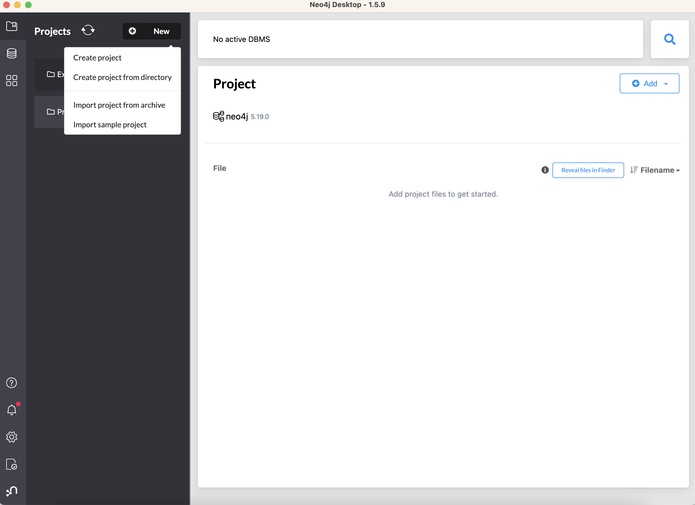

    2. Rename the project name to My Project by howering on the project name clicking the edit icon and then pressing the tick icon.
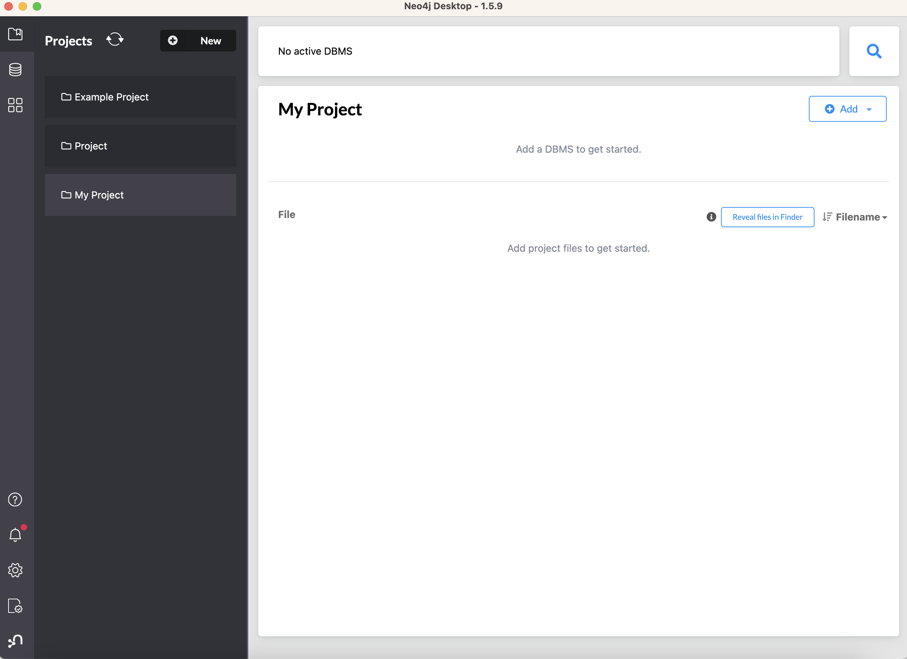

    3. Add a Local DBMS to the project by clicking on the "Add" button and then selecting the "Local DBMS" option. After that enter the details name/password of your Local Database and select *5.19.0* Version number, as shown in the screenshots below. Please select the specified version only. Lastly click the create button.
    
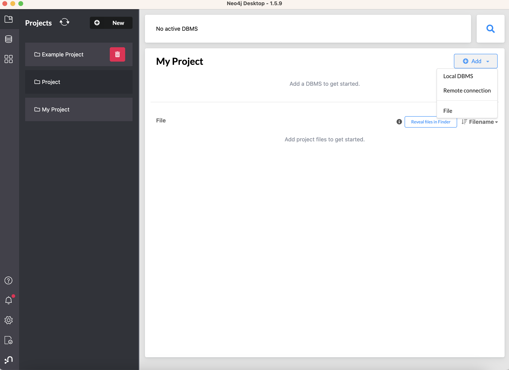 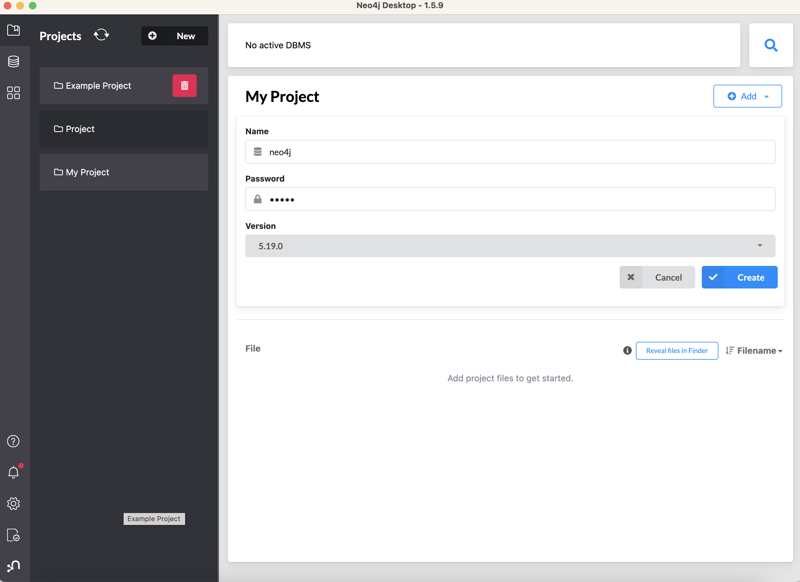

    4. Click three dots besides the "Open" Button then click on the "Open Folder" option and then click on the "Import" button. A local directory location will be open open up, we need to paste (./neo4jScripts/products.json & ./neo4jScripts/categories.json) data files here. 
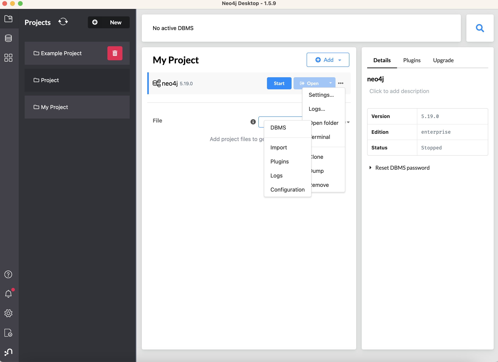 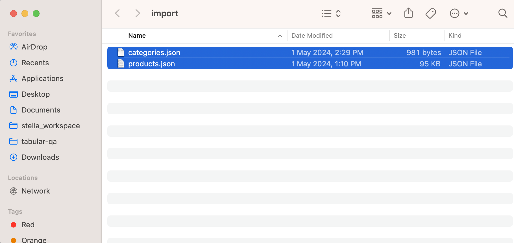

    5. Again click three dots besides the "Open" Button then click on the "Open Folder" option and then click on the "Configuration" option. A local directory location will be open open up, we need to paste (./neo4jScripts/apoc.conf) configuration files here. 
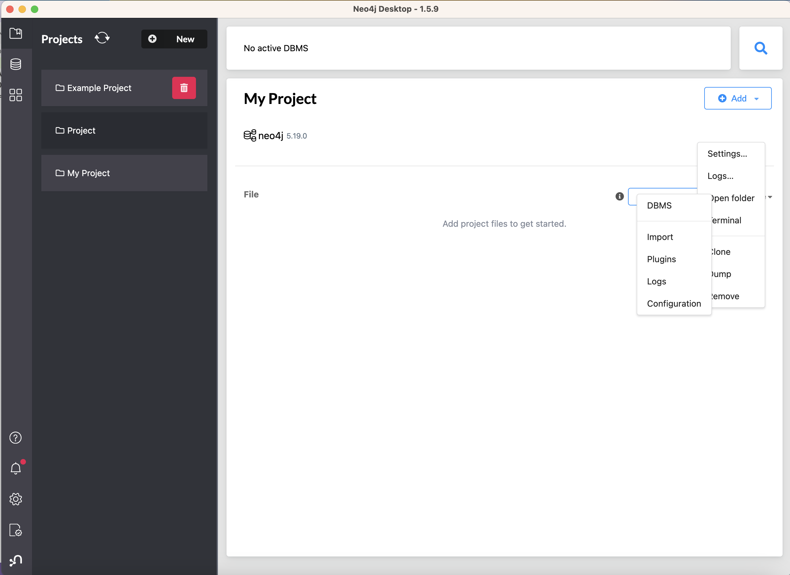

    6. Clink on the header row of the newly created DB ("neo4j 5.19.0" in our case) to open-up the details of the setuped local DBMS and then click on "Plugins" -> Click on APOC and then click on "install" button.
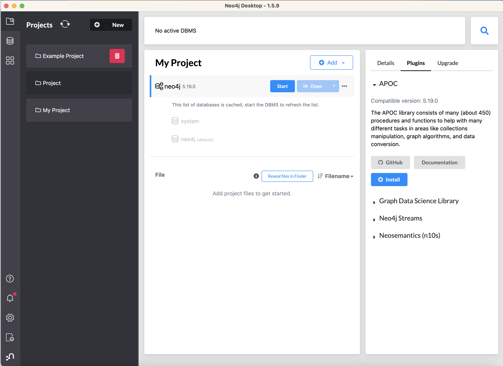

    7. Next Just click the "start" button, to start the Local DBMS.
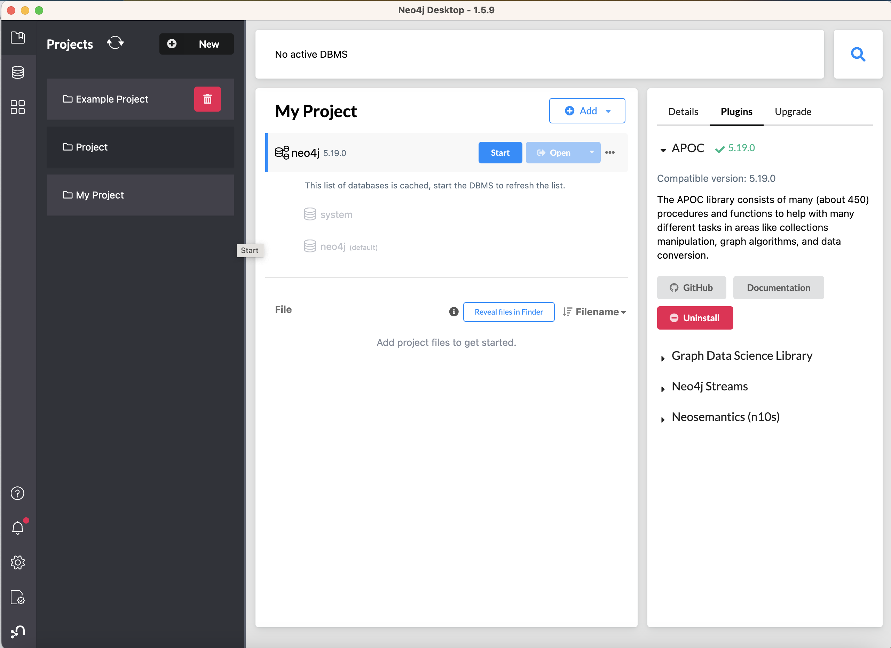

    8. After that click the drop down button insied the "Open" Button on the top and select the "Neo4j Browser" option, as shown in the screen shot.
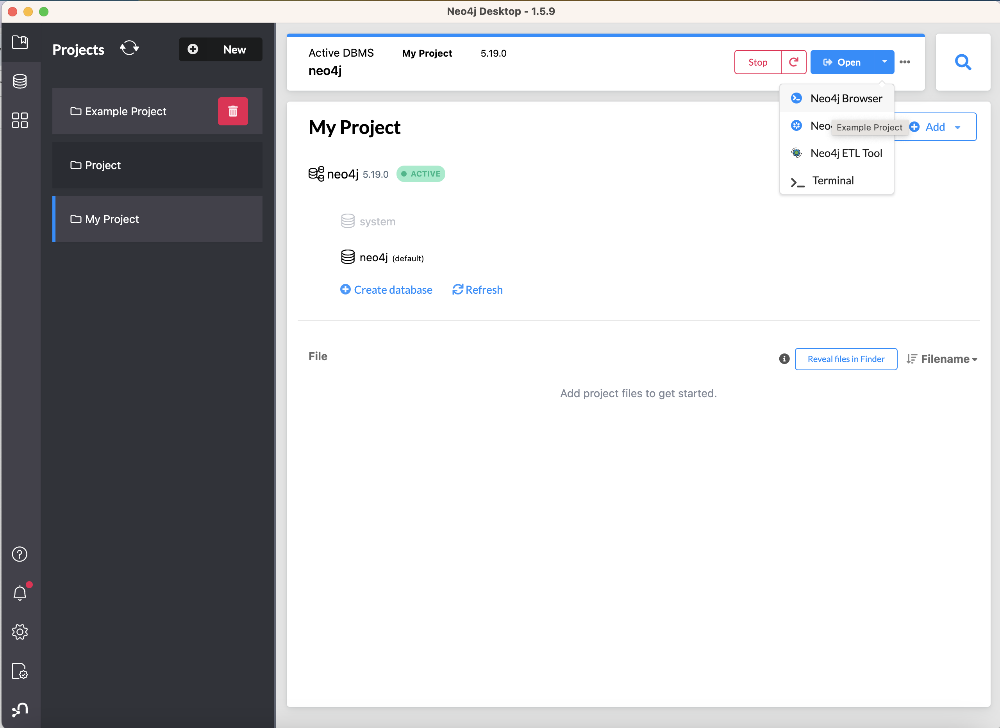

    9. In the newly opend window, shown in the screenshot below, we will going to execute the cypher statements.
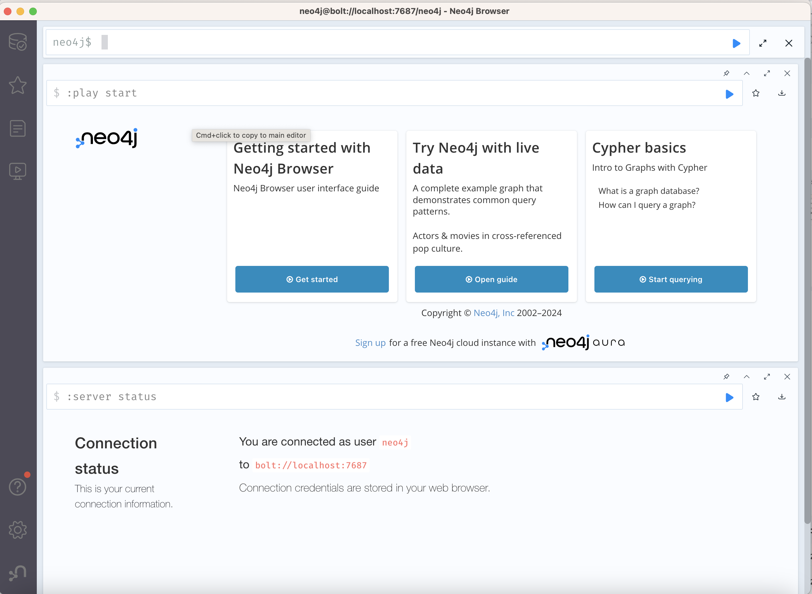

    10. Open (./neo4jScripts/NEO-4J MIGRATION SCRIPTS LOCAL.md) file, and execute the cypher statements from SCRIPT-1 to SCRIPT-10, iteratively, one by one, as shown in the screenshot below.
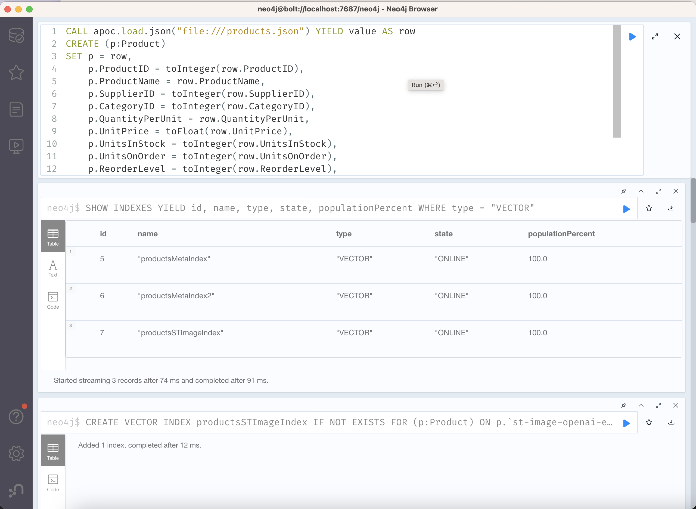 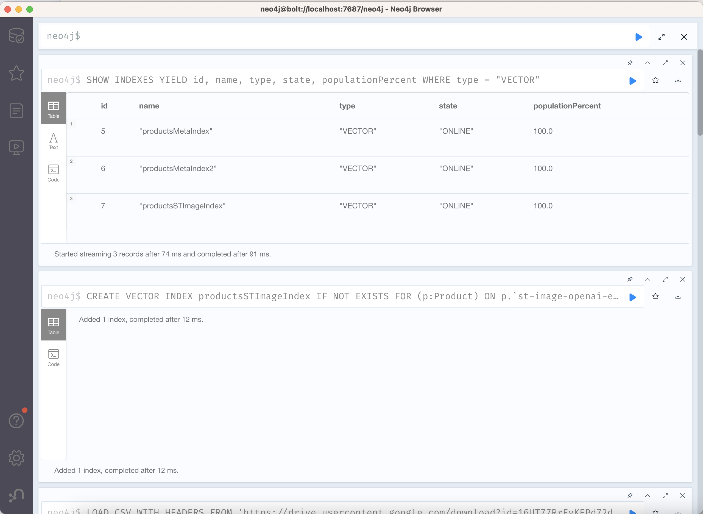

## SETUP SECRETS.toml
    1. Create a secrets.toml file inside the (.streamlit) directory with the following contents
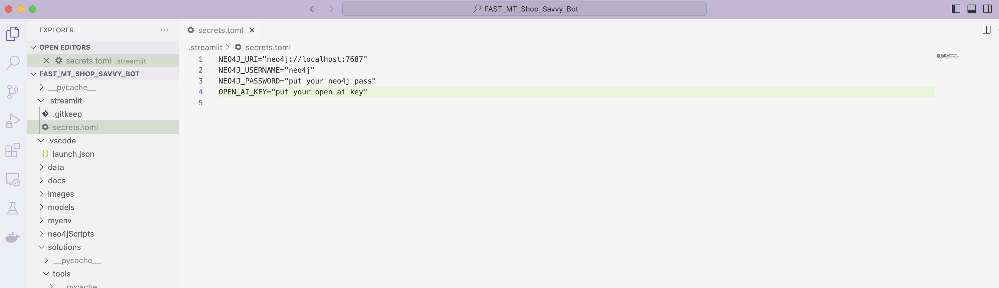

To run the application, you must install the libraries listed in `requirements.txt`.

## RUN THE PROJECT
    1. First Create a virtual enviroment with the following command.
```sh
source myenv/bin/activate
```
    2. Ensure the virtual enviroment is activated and all the dependedncies are installed correctly with the following commands
```sh
pip3 install -r requirements.txt
```
    
    3. Lastly, make sure that neo4j database server is up and running then run the `streamlit run` command to start the app. 
```sh
streamlit run bot.py
```
